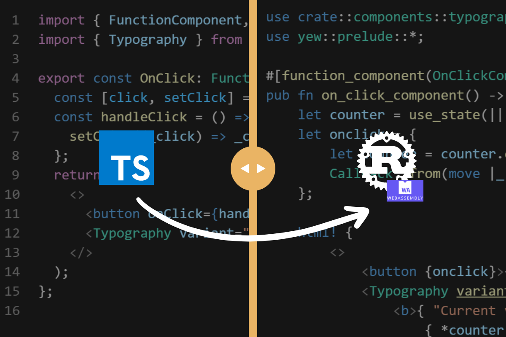

# The TypeStacean -  How to learn Rust WASM as a TypeScript developer using examples
It doesn't need to be that hard.



How you can get to speed with WASM as fast as possible as a TypeScript Developer by showcasing comparable examples between React and Yew. 

Rust's Web Assembly Concepts for TypeScript Developers 

This contains a dual-runnable project which allows you to see React and Yew code side by side. 

# How to use
This project is fully bootable and can be accessed by running:
### React:
1. Install [pnpm](https://pnpm.io/installation). 
2. Run pnpm install.
3. Run pnpm dev (To Launch the dev server)

### Rust - Yew
1. Install [trunk](https://trunkrs.dev/)
```sh
cargo install trunk
```
2. Run `trunk serve`.
3. Visit `http://localhost:8080`

You will now be able to see the same project running in both React and Yew.

Everything is inside the source folder. Things may get funny if you try running both the Yew project and React. 

## Notes:
* Do not use this project structure or naming convention as an example for your Rust WASM or TypeScript project. 
* It was intentionally done to showcase the parity between the two approaches.
* Trunk will get into an infinite loop if you have `trunk serve` running while editing `.ts` and `.tsx` files.
* Folders follow Rust's snake case convention as the built-in linter will return warnings.

## Feedback is appreciated.
If you've seen there's a piece of code that we can improve, by all means!